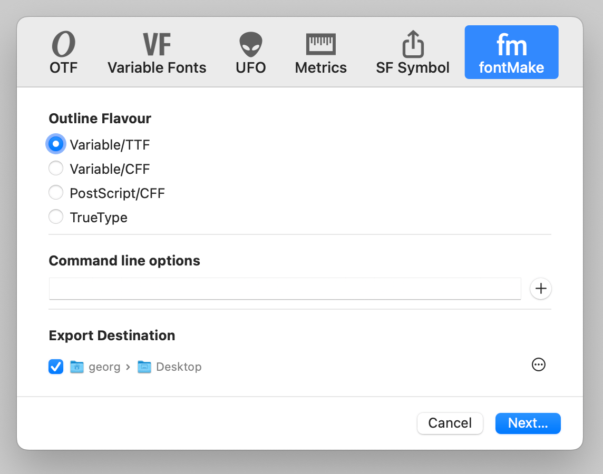

### FontMake export plugin

And export plugin for Glyphs that uses fontMake and glyphsLib to export fonts. When installed, it shows up in the regular Export dialog (Cmd+E).

It will install its own environment and downloads the latest version of required libraries. Those are stored in slide the plugin and thous are removed when the plugin is deleted. 

The "Command line options" accept whatever fontMake accepts. 

there is a "Update FontMake" option the gear button in the lower right. 